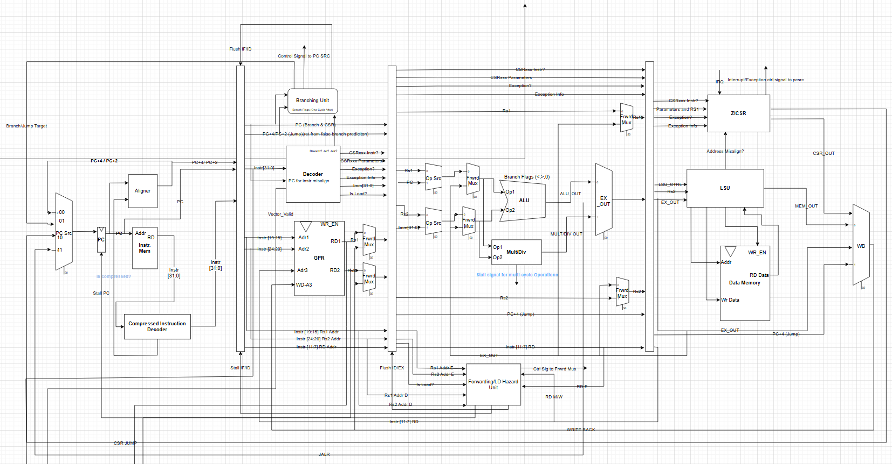
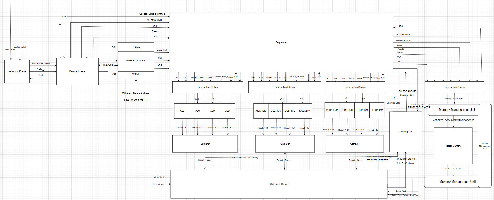

# Custom RISC-V RV32IMCV Core with Vector Coprocessor

This project was developed as my **bachelor’s thesis** in Communication Systems Engineering at Ain-Shams University. It implements a custom **RISC-V RV32IMCV scalar core** along with a **vector coprocessor** to explore vector processing extensions and hardware design techniques.

---

## Scalar Core

The scalar core is a **RV32IMCV processor** designed from scratch, featuring:

- RV32I base instructions with **M (multiply/divide), C (compressed)** extensions
- A simple 5-stage pipeline (Fetch, Decode, Execute, Memory, Writeback)
- Fully synthesizable RTL implementation in Verilog
- Tested using custom simulation testbenches

**Block Diagram:**

This core forms the base processor and manages communication with the vector coprocessor.

---

## Vector Coprocessor

The vector coprocessor extends the scalar core with support for **vector instructions**. Key features:

- **Instruction Sequencer:**  
  - Receives one instruction at a time from the scalar core  
  - Detects instruction type and forwards to the correct execution unit (**ALU, MUL, DIV, RED, PER, MMU**)  
  - Issues instructions in order, but execution is out of order depending on latency  

- **Reservation Stations:**  
  - Can hold up to 2 instructions per unit  
  - Prepares operands and forwards them to execution units  

- **Execution Units:**  
  - Each unit has 4 parallel sub-units (e.g., 4 ALUs, 4 MULs)  
  - Handles different **SEW (standard element widths)** efficiently:  
    - SEW 32 → 1 cycle  
    - SEW 16 → 2 cycles  
    - SEW 8 → 4 cycles  

- **Gatherers:**  
  - Reassemble outputs from execution units into complete vectors  

- **Write Back Queue:**  
  - Ensures **in-order committing**  
  - For memory instructions, results go directly to the **MMU**  

- **Chaining Unit:**  
  - Forwards operands **LIVE** from gatherers or from the write back queue if vectors are ready but not yet written back  

- **Memory System:**  
  - Vector memory organized into **4 banks**  
  - **MMU** handles loads and stores  
  - For write instructions, the MMU outputs the vector to the write back queue  

**Block Diagram:**

The coprocessor allows executing parallel operations efficiently, demonstrating the benefits of vector extensions in RISC-V.

---
## Supported Vector Instructions

The vector coprocessor currently supports the following instructions, with **SEW = 32, 16, 8**:

- **Arithmetic and Logical Operations:**  
  - `VADD`, `VSUB`, `VRSUB`  
  - `VAND`, `VOR`, `VXOR`  
  - `VMINU`, `VMIN`, `VMAXU`, `VMAX`  
  - `VSLL`, `VSRL`, `VSRA`, `VSSRL`, `VSSRA`  

- **Mask Operations:**  
  - `VMSEQ`, `VMSNE`, `VMSLTU`, `VMSLT`, `VMSLEU`, `VMSLE`, `VMSGTU`, `VMSGT`  
  - `VMAND`, `VMANDN`, `VMOR`, `VMORN`, `VMNOR`, `VMXOR`, `VMXNOR`, `VMNAND`  

- **Multiplication:**  
  - `VMULHU`, `VMUL`, `VMULHSU`, `VMULH`  

- **Division / Remainder:**  
  - `VDIVU`, `VDIV`, `VREMU`, `VREM`  

- **Permutation / Slide:**  
  - `VSLIDEUP`, `VSLIDEDOWN`, `VCOMPRESS`  

 **Supported vector element widths (SEW) of 32, 16, and 8 bits**.

## Implementation

- **RTL Language:** Verilog + System Verilog
- **Verification:** Functional simulation using [Questasim]

---

## Results

- The **scalar core** passed the **RISC-V Compliance Framework** and was synthesized to **2,168 LUTs** on Xilinx Vivado.  
- The **vector coprocessor** demonstrated **~20× speedup** for parallel workloads (from test programs).  
- Together, they provide a solid foundation for exploring RISC-V vector extensions in future work.

---

## Future Work

- Full RISC-V vector ISA support
- Optimization for higher throughput and reduced latency
- Integration with larger SoC designs

---

## License

This project is for academic purposes. Please refer to the license file for terms.
